# xyzrender: Publication-quality molecular graphics from the command line.

Render molecular structures as publication-quality SVG, PNG, PDF, and animated GIF from XYZ files or quantum chemistry output.

[](https://pepy.tech/projects/xyzrender)
[](https://github.com/aligfellow/xyzrender/blob/main/LICENSE)
[](https://docs.astral.sh/uv)
[](https://github.com/astral-sh/ruff)
[](https://github.com/astral-sh/ty)
[](https://github.com/aligfellow/xyzrender/actions)
[](https://codecov.io/gh/aligfellow/xyzrender)

xyzrender turns XYZ files and quantum chemistry output (ORCA, Gaussian, Q-Chem, etc.) into clean SVG, PNG, PDF, and animated GIF graphics — ready for papers, presentations, and supporting information. The SVG rendering approach is built on and inspired by [**xyz2svg**](https://github.com/briling/xyz2svg) by [Ksenia Briling **@briling**](https://github.com/briling).

Most molecular visualisation tools require manual setup: loading files into a GUI, tweaking camera angles, exporting at the right resolution and adding specific TS or NCI bonds. `xyzrender` skips this. One command gives you a (mostly) oriented, depth-cued structure with correct bond orders, aromatic ring rendering, automatic bond connectivity, with TS bonds and NCI bonds.

 

**What it handles out of the box:**

- **Bond orders and aromaticity** — double bonds, triple bonds, and aromatic ring notation detected automatically from geometry via [`xyzgraph`](https://github.com/aligfellow/xyzgraph)
- **Transition state bonds** — forming/breaking bonds rendered as dashed lines, detected automatically from imaginary frequency vibrations via [`graphRC`](https://github.com/aligfellow/graphRC)
- **Non-covalent interactions** — hydrogen bonds and other weak interactions shown as dotted lines, detected automatically via [`xyzgraph`](https://github.com/aligfellow/xyzgraph)
- **GIF animations** — rotation, TS vibration, and trajectory animations for presentations
- **Molecular orbitals** — render MO lobes from cube files with front/back depth cueing
- **Electron density surfaces** — depth-graded translucent isosurfaces from density cube files
- **Electrostatic potential (ESP)** — ESP colormapped onto the density surface from paired cube files
- **vdW surface overlays** — van der Waals spheres on all or selected atoms
- **Depth fog and gradients** — 3D depth cues without needing a 3D viewer
- **Multiple output formats** — SVG (default), PNG, PDF, and GIF from the same command

**Preconfigured but extensible.** Built-in presets (`default`, `flat`, `paton`) cover common use cases. Every setting — colors, radii, bond widths, gradients, fog — can be overridden via CLI flags or a custom JSON config file.

```bash
xyzrender caffeine.xyz                          # SVG with sensible defaults
xyzrender ts.out --ts -o figure.png             # TS with dashed bonds as PNG
xyzrender caffeine.xyz --gif-rot -go movie.gif  # rotation GIF for slides
```

## Installation

### From PyPI:  

```bash
pip install xyzrender
```

Or with [uv](https://docs.astral.sh/uv/):

```bash
uv tool install xyzrender
```

To test without installing, you can use [uvx](https://docs.astral.sh/uv/guides/tools/#running-tools)

```bash
uvx xyzrender 
```

### From Source:

Using pip: 

```bash
git clone https://github.com/aligfellow/xyzrender.git
cd xyzrender
pip install .
# install in editable mode
pip install -e .
# or straight from git
pip install git+https://github.com/aligfellow/xyzrender.git
```

Or if you'd rather use [uv](https://docs.astral.sh/uv/):

```bash
git clone https://github.com/aligfellow/xyzrender.git
cd xyzrender
uv tool install .
# install in editable mode
uv tool install --editable .
# or straight from git
uv tool install git+https://github.com/aligfellow/xyzrender.git
```

## Quick start

```bash
# Render from XYZ file (writes caffeine.svg by default)
xyzrender caffeine.xyz

# Render from QM output (ORCA, Gaussian, Q-Chem, etc.)
xyzrender calc.out

# Explicit output path — extension controls format
xyzrender caffeine.xyz -o render.png
xyzrender caffeine.xyz -o render.pdf

# Pipe from stdin (writes graphic.svg)
cat caffeine.xyz | xyzrender
```

Output defaults to `{input_basename}.svg`. Use `-o` to specify a different path or format.

## Examples

Sample structures are in [`examples/structures/`](examples/structures/). Rendered outputs and the generation script are in [`examples/`](examples/). To regenerate all outputs:

```bash
uv run bash examples/generate.sh
```

### Presets

| Default | Flat | Paton (pymol-like) |
|---------|------|-------|
| 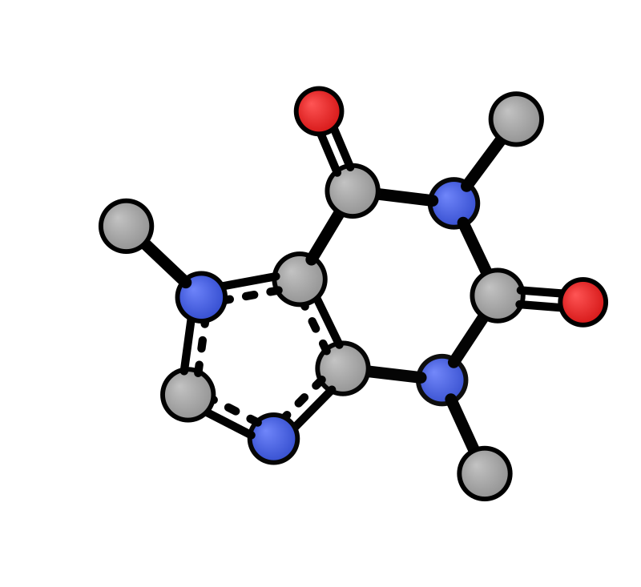 |  | 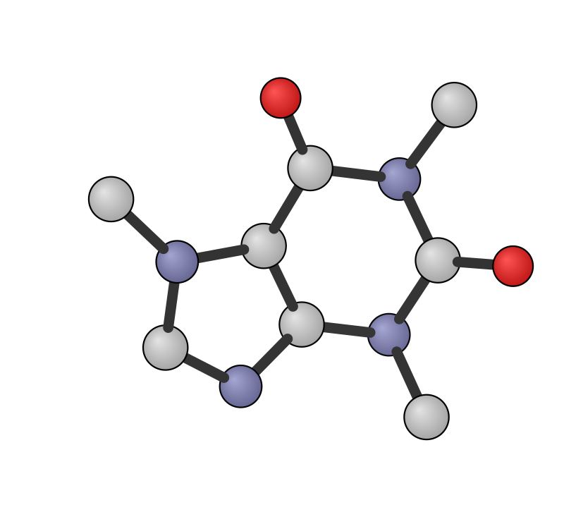 |

```bash
xyzrender caffeine.xyz -o caffeine_default.svg              # default preset
xyzrender caffeine.xyz --config flat -o caffeine_flat.svg   # flat: no gradient
xyzrender caffeine.xyz --config paton -o caffeine_paton.svg # paton: PyMOL-style
```

The `paton` style is inspired by the clean styling used by [Rob Paton](https://github.com/patonlab) through PyMOL (see [gist](https://gist.github.com/bobbypaton/1cdc4784f3fc8374467bae5eb410edef))

### Display options

| All H | Some H | No H | 
|-------|--------|------|
| 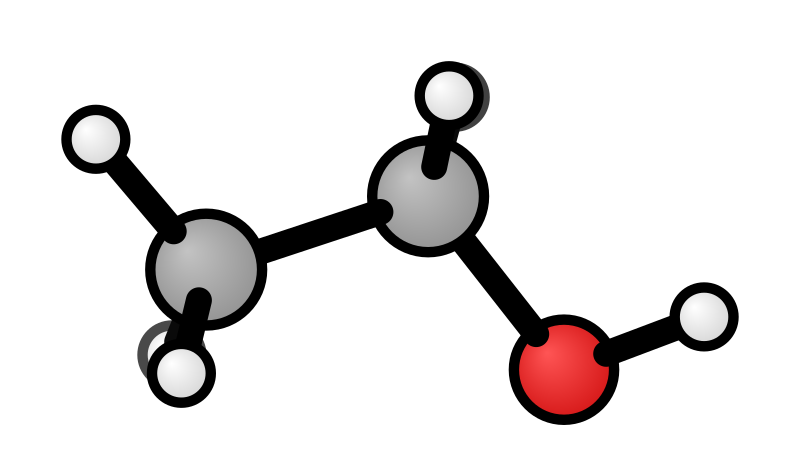 | 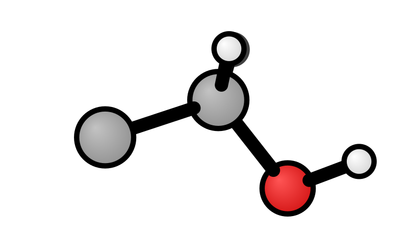 | 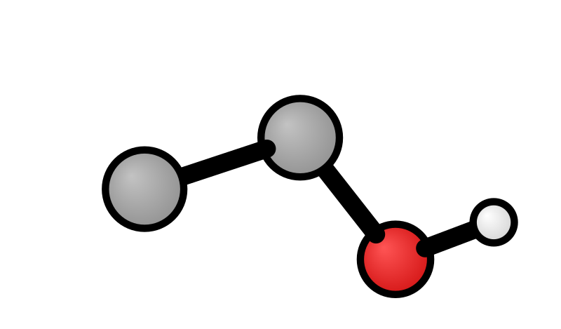 | 

| Aromatic | Kekule |
|----------|--------|
| 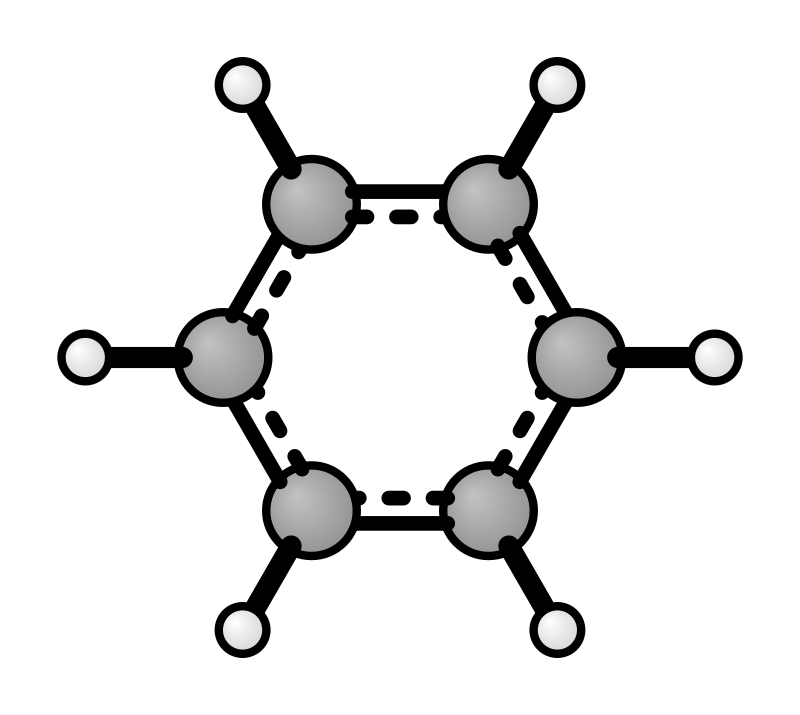 | 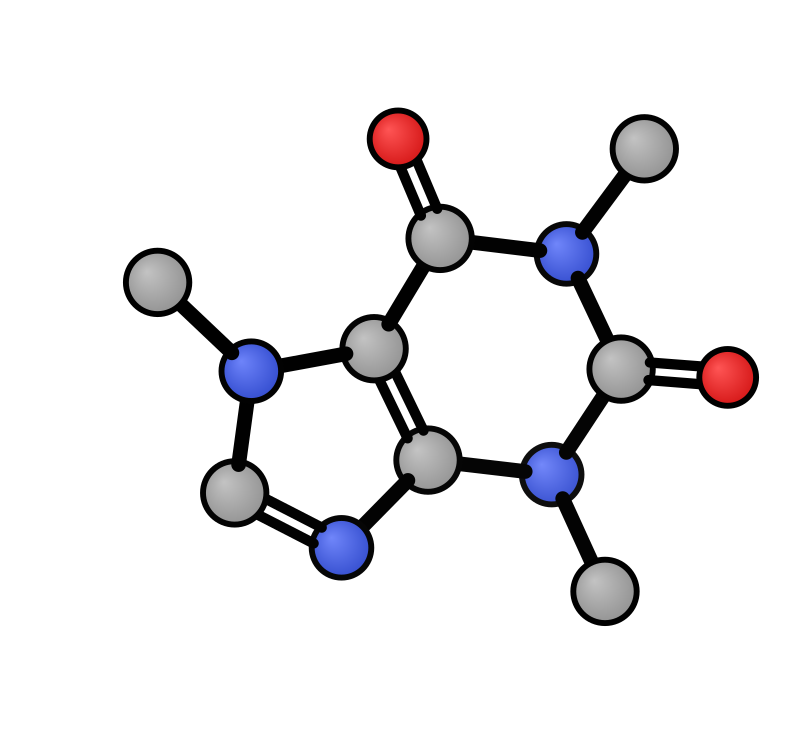 |

```bash
xyzrender ethanol.xyz --hy -o ethanol_all_h.svg         # all H
xyzrender ethanol.xyz --hy 7 8 9 -o ethanol_some_h.svg  # specific H atoms
xyzrender ethanol.xyz --no-hy -o ethanol_no_h.svg       # no H
xyzrender benzene.xyz --hy -o benzene.svg               # aromatic
xyzrender caffeine.xyz --bo -k -o caffeine_kekule.svg   # Kekule bond orders
```

### vdW spheres

| All atoms | Some vdW | paton-style |
|-----------|--------|--------|
| 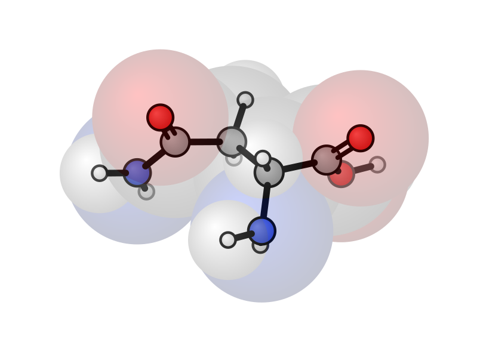 | 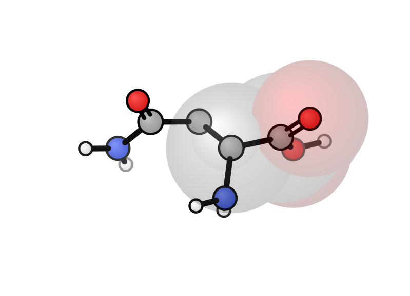 |  |

```bash
xyzrender asparagine.xyz --hy --vdw -o asparagine_vdw.svg  # vdW spheres on all atoms
xyzrender asparagine.xyz --hy --vdw "1-6" -o asparagine_vdw_partial.svg  # vdW spheres on some atoms
xyzrender asparagine.xyz --hy --vdw --config paton -o asparagine_vdw_paton.svg  # vdW spheres on all atoms
```

### Transition states and NCI

xyzrender uses [xyzgraph](https://github.com/aligfellow/xyzgraph) for molecular graph construction from Cartesian coordinates — determining bond connectivity, bond orders, detecting aromatic rings, and non-covalent interactions. It also provides element data (van der Waals radii, atomic numbers) used throughout rendering.

Transition state analysis uses [graphRC](https://github.com/aligfellow/graphRC) for internal coordinate vibrational mode analysis. Given a QM output file (ORCA, Gaussian, etc.), graphRC identifies which bonds are forming or breaking at the transition state with `--ts`. These are rendered as dashed bonds. graphRC is also used to generate TS vibration frames for `--gif-ts` animations.

NCI detection uses [xyzgraph](https://github.com/aligfellow/xyzgraph)'s `detect_ncis` to identify hydrogen bonds, halogen bonds, pi-stacking, and other non-covalent interactions from geometry. These are rendered as dotted bonds. For pi-system interactions (e.g. pi-stacking, cation-pi), centroid dummy nodes are placed at the mean position of the pi-system atoms. For trajectory GIFs with `--nci`, interactions are re-detected per frame.

| Auto TS | Manual TS bond |
|------|----------------|
|  |  |

```bash
xyzrender sn2.out --hy --ts -o sn2_ts.svg
xyzrender sn2.out --hy --ts-bond "1-2" -o sn2_ts_man.svg  # specific TS bond only
```

| Auto NCI | Manual NCI |
|------|----------------|
|  |  |

```bash
xyzrender Hbond.xyz --nci -o nci.svg                # auto-detect all NCI interactions
xyzrender Hbond.xyz --nci-bond "8-9" -o nci_man.svg  # specific NCI bond only
```

### QM output files

| ORCA | Gaussian (TS) |
|------|----------------|
| 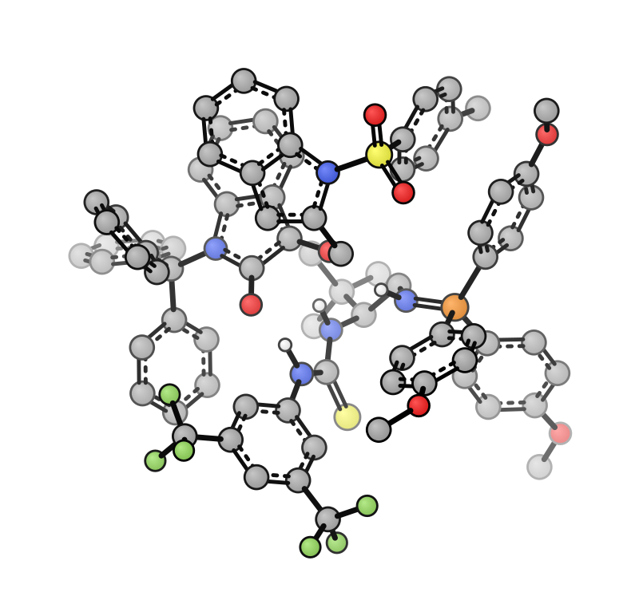 | 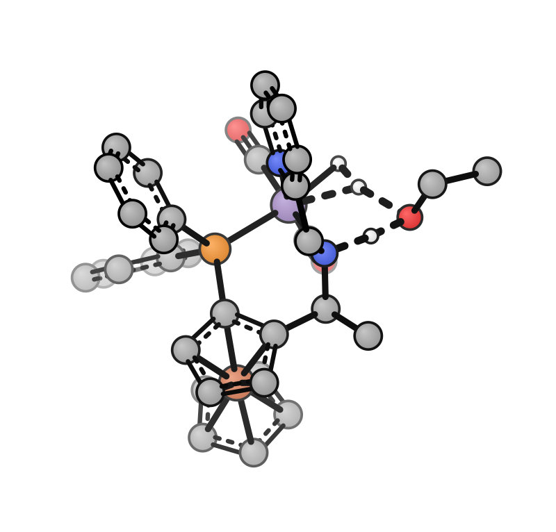 |

```bash
xyzrender bimp.out -o bimp_qm.svg             # ORCA output
xyzrender mn-h2.log -o mn-h2_qm.svg --ts      # Gaussian log with TS detection
```

### Measurements & annotations

#### Bond measurements (`--measure`)

Print bonded distances, angles, and dihedral angles to stdout as a formatted table. This is terminal-only — the SVG is still rendered as normal.

```bash
xyzrender ethanol.xyz --measure 
xyzrender ethanol.xyz --measure d # bonded distances only (a for angles, t for torsion/dihedral)
```

```text
Bond Distances:
     C1 - C2     1.498Å
     C1 - H4     1.104Å
     ...
Bond Angles:
     C2 - C1 - H5     109.62°
     C2 - C1 - H6     111.98°
     ...
Dihedral Angles:
     H5 - C1 - C2 - O3      -55.99°
     H5 - C1 - C2 - H7     -177.53°
     ...
```

- `d`, `a` and `t` can be combined
- *e.g.* `--measure d a` prints bonds and angles only

#### Atom index labels (`--idx`)

Add atom index labels centred on every atom in the SVG. Three format options:

| Index + symbol | Index only |
|----------------|------------|
|  |  |

```bash
xyzrender caffeine.xyz --idx                          # symbol + index
xyzrender caffeine.xyz --hy --idx n --label-size 25   # index only
xyzrender caffeine.xyz --hy --idx s                   # symbols only
```

#### SVG annotations (`-l` / `--label`) 

Annotate specific bonds, angles, atoms, or dihedrals with computed or custom text. The **last token** of each spec determines its type. All atom indices are **1-based**.

| Spec | SVG output |
|------|------------|
| `-l 1 2 d` | Distance text at the 1–2 bond midpoint |
| `-l 1 d` | Distance text on every bond incident to atom 1 |
| `-l 1 2 3 a` | Arc at atom 2 (the vertex) + angle value text |
| `-l 2 a` | Arc + value for all angles where atom 2 is the vertex |
| `-l 1 2 3 4 t` | Colored line 1-2-3-4 + dihedral value near bond 2–3 |
| `-l 1 +0.512` | Custom text near atom 1 |
| `-l 1 2 NBO` | Custom text at the 1–2 bond midpoint |

| distances + angles + dihedrals | custom annotation | 
|-------------------|-------------------|
|  |  | 


```bash
xyzrender caffeine.xyz -l 13 6 9 4 t -l 1 a -l 14 d -l 7 12 8 a -l 11 d
xyzrender caffeine.xyz -l 1 best -l 2 "NBO: 0.4"
```

- `-l` is repeatable  
- For explicit bond pairs (`i j d`) with no actual bond edge in the graph, a warning is printed and the label is placed at the midpoint anyway  
  - useful for hydrogen-bond or contact distances.

**Bulk annotation file** (`--label FILE`):

Same syntax, per line. Lines whose first token is not an integer (e.g. CSV headers) are silently skipped, so df can be written directly to file. Comment lines (#) are okay, quoted labels are okay (*e.g.* "pKa: 5")

| Label file |
|---------------------|
|  |

```
# sn2_charges.txt — comma or whitespace separated,
2 1 d 
1 22 d
2 1 22 a
```

```bash
xyzrender sn2.out --ts --label sn2_label.txt --label-size 40
```

#### Atom property colormap (`--cmap`)

Color atoms by a per-atom scalar value using a Viridis-like colormap. Useful for partial charges, and any other atomic property.

| Mulliken charges | Symmetric range |
|------------------|------------------| 
|  |  | 


The colormap file has two columns - **1-indexed atom number** and value. Any extension works (*e.g.* `.txt`, `.csv`) as long as this file is comma or whitespace separated. Header lines (any line whose first token is not an integer) are silently skipped. Comment and blank lines (`#`) are also skipped.

```
# charges.txt — whitespace or comma separated
1  +0.512
2  -0.234
3   0.041
```

```bash
xyzrender caffeine.xyz --hy --cmap caffeine_charges.txt --gif-rot
xyzrender caffeine.xyz --hy --cmap caffeine_charges.txt --cmap-range -0.5 0.5
```

- Atoms **in the file**: colored by Viridis-like colormap (dark purple → blue → green → yellow-green → bright yellow). This colormap never passes through white.
- Atoms **not in the file**: white (`#ffffff`). White is never a Viridis output, so is unambiguously *not mapped*. The unlabeled color can be overridden via `"cmap_unlabeled"` in a custom preset JSON.
- Range defaults to the min/max of provided values; override with `--cmap-range vmin vmax`. Use this for a symmetric colour scale.

### GIF animations

| Rotation (y) | Rotation (xy) |
|--------------|---------------|
| 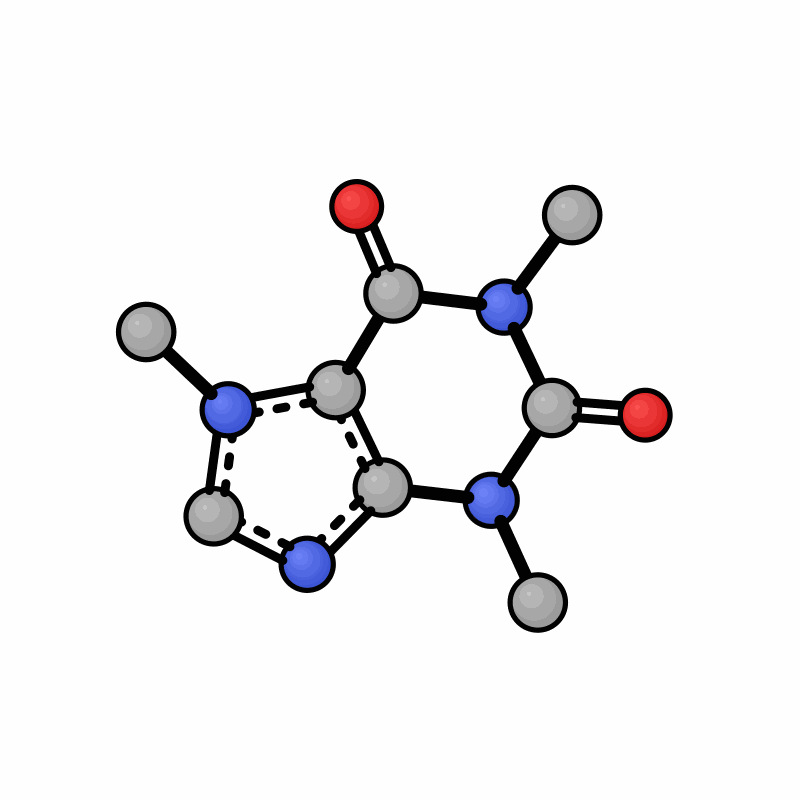 |  |

| TS vibration + rotation | TS vibration | Trajectory |
|-------------------------|--------------|------------|
|  | 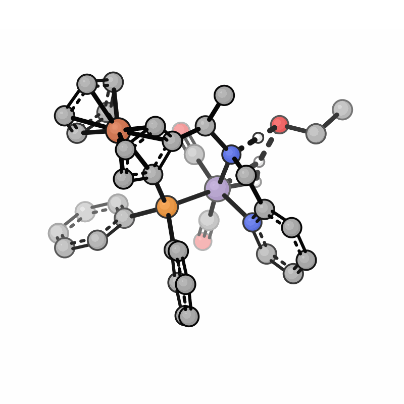 | 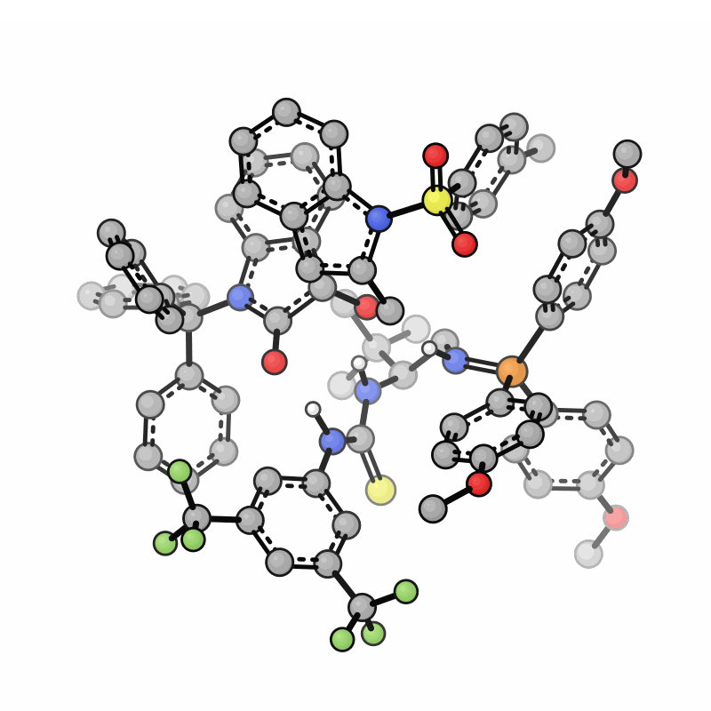 |

```bash
xyzrender caffeine.xyz --gif-rot -go caffeine.gif                          # rotation (y-axis)
xyzrender caffeine.xyz --gif-rot xy -go caffeine_xy.gif                    # rotation (xy axes)
xyzrender bimp.out --gif-rot --gif-ts --vdw 84-169 -go bimp.gif           # TS vibration + rotation
xyzrender mn-h2.log --gif-ts -go mn-h2.gif                                # TS vibration
xyzrender bimp.out --gif-trj --ts -go bimp_trj.gif                        # trajectory with TS bonds
```

GIF defaults to `{input_basename}.gif`. Use `-go` to override.

### Combined options

The visualisation supports most combinations of these options.  
- `--gif-ts` and `--gif-trj` are *mutually exclusive*

| TS animation | trj animation |
|--------------|---------------|
|  |  |

```bash
xyzrender bimp.out --gif-ts --gif-rot --nci --vdw 84-169 -go bimp_nci_ts.gif  # TS animation + nci + vdW + rotate
xyzrender bimp.out --gif-trj --nci --ts --vdw 84-169 -go bimp_nci_trj.gif  # TS bonds + nci + vdW + trj
```

### Molecular orbitals

Render molecular orbitals from cube files (`.cube`). Requires the `--mo` flag. The cube file contains both the molecular geometry and a 3D volumetric grid of orbital values so no separate XYZ file needed.

| HOMO | LUMO | 
|------|------|
|  | 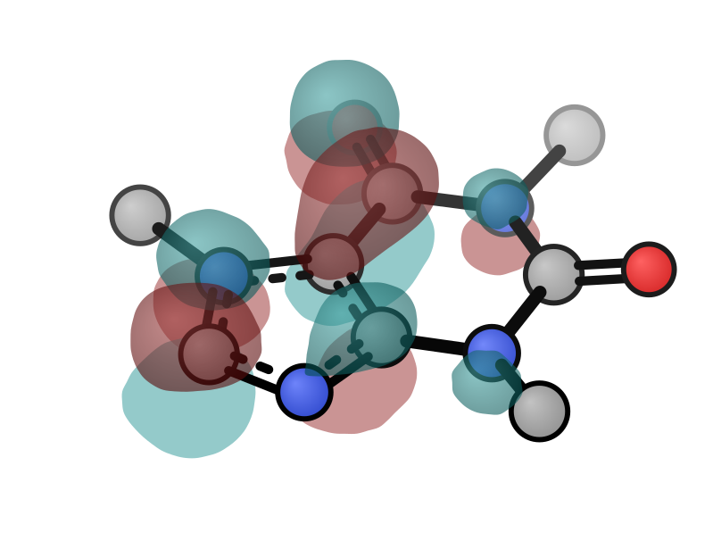 | 

| HOMO + H (iso 0.03) | HOMO rotation |
|---------------------|---------------|
| |  |


```bash
xyzrender caffeine_homo.cube --mo -o caffeine_homo.svg              # HOMO
xyzrender caffeine_lumo.cube --mo --mo-colors maroon teal -o caffeine_lumo.svg  # LUMO
xyzrender caffeine_homo.cube --mo --hy --iso 0.03 -o homo_iso_hy.svg  # MO + H atoms + custom isovalue
xyzrender caffeine_homo.cube --mo --gif-rot -go caffeine_homo.gif   # rotation GIF with MO
```

These cube files should be made separately, *e.g.* with [ORCA](https://www.faccts.de/docs/orca/6.1/manual/contents/utilitiesvisualization/utilities.html?q=orca_plot&n=0#orca-plot):
```bash
orca_plot caffeine.out -i 
```

MO-specific flags:

| Flag | Description |
|------|-------------|
| `--mo` | Enable MO lobe rendering (required for `.cube` input) |
| `--iso` | Isosurface threshold (default: 0.05, smaller = larger lobes) |
| `--opacity` | (Surface opacity multiplier, default: 1.0) |
| `--mo-colors POS NEG` | Lobe colors as hex or [named color](https://matplotlib.org/stable/gallery/color/named_colors.html) (default: `steelblue` `maroon`) |

Cube files are typically generated by ORCA (`orca_plot` block) or Gaussian (`cubegen`).

When `--mo` is used with auto-orientation (the default), the molecule is tilted 45 degrees around the x-axis after alignment. This separates orbital lobes above and below the molecular plane so they are clearly visible in the 2D projection. Use `--no-orient` to disable this and render in the raw cube file coordinates or `--interactive` for orientation with [`v`](https://github.com/briling/v) (below).

This has been tested using MO cube files generated from ORCA (see the [**documentation**](https://www.faccts.de/docs/orca/6.1/manual/contents/utilitiesvisualization/utilities.html?q=cube&n=1#orca-plot) for more information).

### Electron density surface

> These surface plots are schematic 2D representations suitable for figures. For quantitative isosurface analysis, use a dedicated 3D viewer.

Render electron density isosurfaces from cube files (`.cube`). Uses `--dens` instead of `--mo`. The density surface is rendered as a depth-graded translucent shell — multiple concentric contour rings are stacked with partial opacity so the centre (high density) appears more opaque than the edges.

| Density surface | Density (iso 0.01) |
|-----------------|-------------------|
| 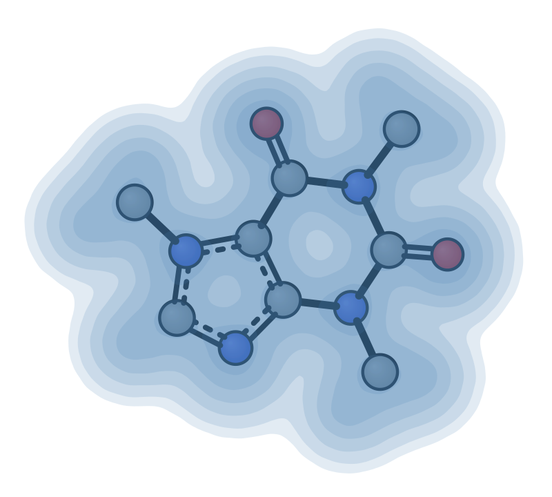 | 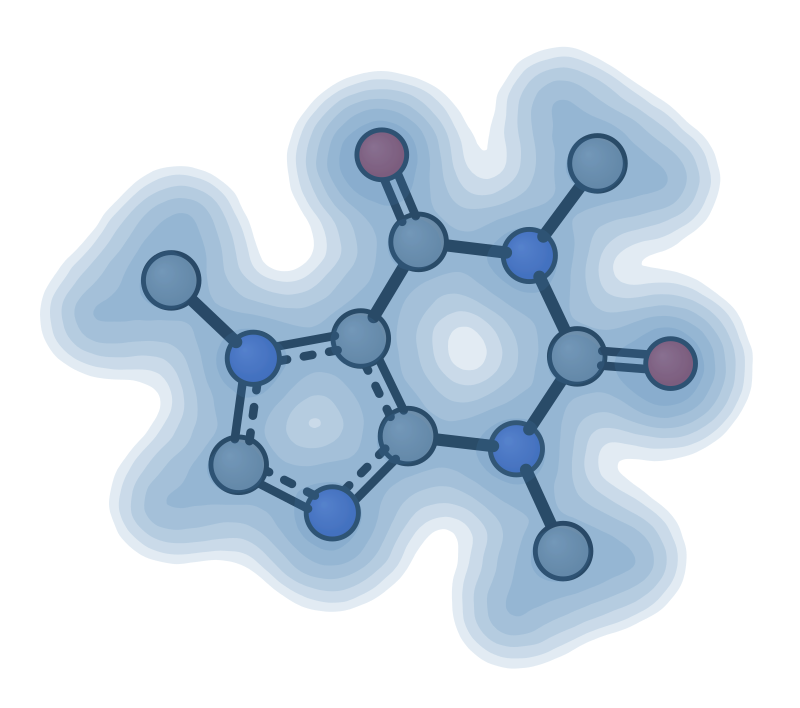 |

| Custom styling | Density rotation |
|---------------|-----------------|
| 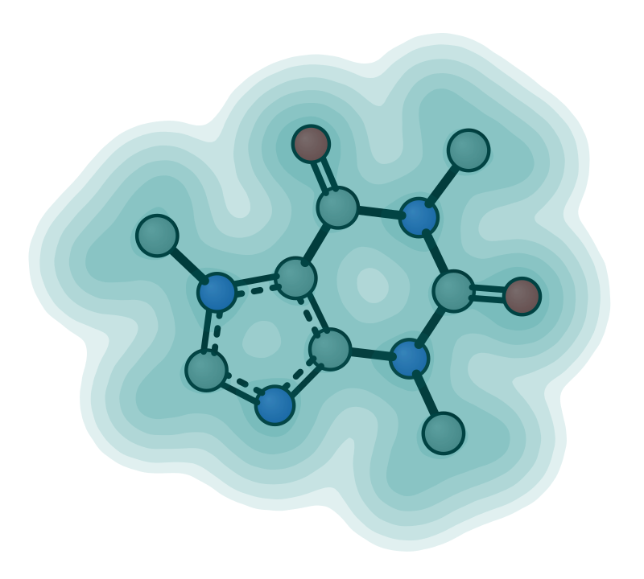 | 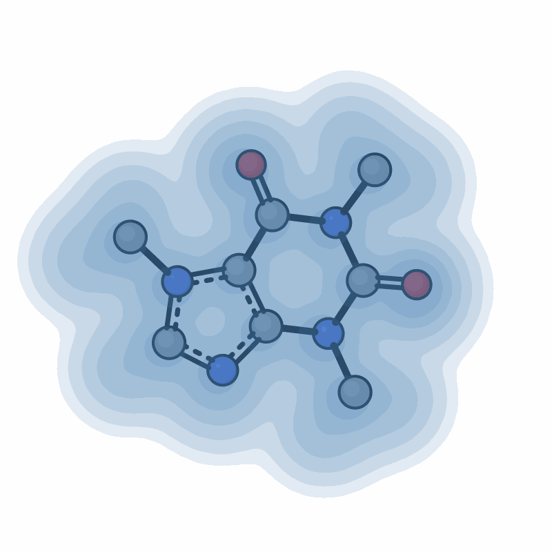 |

```bash
xyzrender caffeine_sp_dens.cube --dens -o caffeine_dens.svg                                   # density surface
xyzrender caffeine_sp_dens.cube --dens --iso 0.01 -o caffeine_dens_iso.svg                    # larger isovalue (smaller surface)
xyzrender caffeine_sp_dens.cube --dens --dens-color teal --opacity 0.75 -o caffeine_dens_styled.svg  # custom color and opacity
xyzrender caffeine_sp_dens.cube --dens --gif-rot -go caffeine_dens.gif                        # rotation GIF
```

This has been tested using density cube files generated from ORCA (see the [**documentation**](https://www.faccts.de/docs/orca/6.1/manual/contents/utilitiesvisualization/utilities.html?q=cube&n=1#orca-plot) for more information).

Density-specific flags:

| Flag | Description |
|------|-------------|
| `--dens` | Enable density isosurface rendering (requires `.cube` input) |
| `--iso` | Isosurface threshold (default: 0.001) |
| `--dens-color` | Surface color as hex or [named color](https://matplotlib.org/stable/gallery/color/named_colors.html) (default: `steelblue`) |
| `--opacity` | (Surface opacity multiplier, default: 1.0) |

Density cube files contain total electron density on a 3D grid. These can be generated with ORCA (`orca_plot` with density mode) or Gaussian (`cubegen` with `density`). `--dens` and `--mo` are mutually exclusive.

### Electrostatic potential (ESP) surface

Map electrostatic potential onto the electron density isosurface using two cube files: a density cube (main input) and an ESP cube (`--esp` argument). Both must come from the same calculation (identical grid dimensions).

The surface is colored using a diverging colormap centered at zero: blue (positive ESP / electron-poor) through green (zero) to red (negative ESP / electron-rich).

| ESP surface | ESP custom |  
|-------------|-------------|  
| 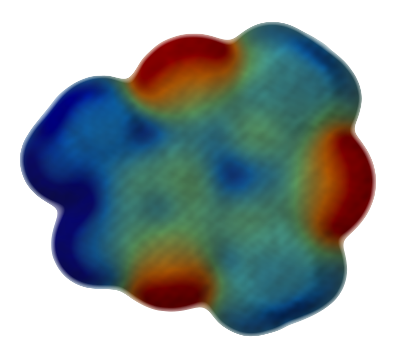 | 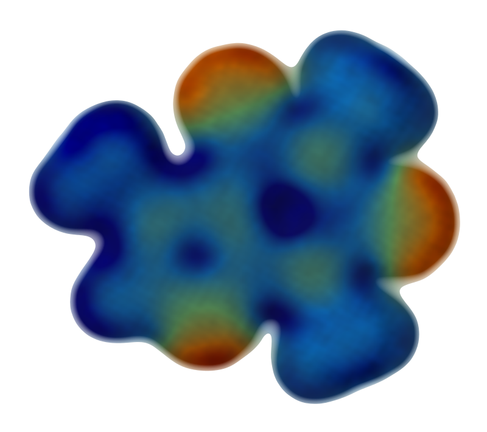 |  

```bash
xyzrender caffeine_dens.cube --esp caffeine_esp.cube -o caffeine_esp.svg
xyzrender caffeine_dens.cube --esp caffeine_esp.cube --iso 0.005 --opacity 0.75 -o caffeine_esp_custom.svg
```

ESP-specific flags:

| Flag | Description |
|------|-------------|
| `--esp CUBE` | ESP cube file path (implies density surface rendering) |
| `--opacity` | (Surface opacity multiplier, default: 1.0) |
| `--iso` | Density isosurface threshold (default: 0.01) |

`--esp` is mutually exclusive with `--mo`, `--dens`, and `--vdw`.
`--gif-rot` is **not available**; however, the `-I` flag allows for interactive orientation of the molecule prior to generating the image.

### Vector arrows

Overlay arbitrary 3D vectors as arrows on the rendered image via a JSON file. Useful for dipole moments, forces, electric fields, transition vectors, etc.

```bash
xyzrender caffeine.xyz --vectors dipole.json -o caffeine_dipole.svg
xyzrender caffeine.xyz --vectors forces.json --vector-scale 0.3 -o caffeine_forces.svg
```

Each entry in the JSON array defines one arrow:

| Key | Type | Default | Description |
|-----|------|---------|-------------|
| `vector` | `[vx, vy, vz]` | *required* | Three numeric components (x,y,z). Use the same coordinate units as the input (Å). Example: `[1.2, 0.0, 0.5]`. |
| `origin` | `"com"` / integer / `[x,y,z]` | `"com"` | Tail location: `"com"` = molecule centroid; integer = 1-based atom index from the input XYZ; list = explicit coordinates. |
| `color` | `"#rrggbb"` / named | `"#444444"` | Arrow color. Accepts hex (`#e63030`) or CSS color names (`steelblue`). |
| `label` | string | `""` | Text placed near the arrowhead (e.g. "μ"). |
| `scale` | float | `1.0` | Per-arrow multiplier applied on top of `--vector-scale`. Final arrow length = `scale * --vector-scale * |vector|`. |

**Example — Dipole Moment:**

 |

```json
{
  "anchor": "center",
  "vectors": [
    {
      "origin": "com",
      "vector": [
        1.0320170291976951,
        -0.042708195030485986,
        -1.332397645862797
      ],
      "color": "red",
      "label": "μ"
    }
  ]
}
```

**Example — forces on heavy atoms due to E field:**

 |

```json
{
  "anchor": "center",
  "units": "eV/Angstrom",
  "vectors": [
    {
      "origin": 1,
      "vector": [
        -0.318122066384213,
        -0.437907743038215,
        0.3679005313657949
      ],
      "color": "red"
    },
    ...
  ]
}
```

## Orientation

Auto-orientation is on by default (largest variance along x-axis). Disabled automatically for stdin and interactive mode.

```bash
xyzrender molecule.xyz                         # auto-oriented
xyzrender molecule.xyz --no-orient             # raw coordinates
xyzrender molecule.xyz -I                      # interactive rotation via v viewer
```

### Interactive rotation (`-I`)

The `-I` flag opens the molecule in the [**v** molecular viewer](https://github.com/briling/v) by [Ksenia Briling **@briling**](https://github.com/briling)
for interactive rotation. Rotate the molecule to the desired orientation, press
`z` to output coordinates, then close the window with `q`. `xyzrender` captures the rotated
coordinates and renders from those.

We can also pipe from `v` directly when working with `.xyz` files: 

```bash
v molecule.xyz | xyzrender
```

Orient the molecule, press `z` to output reoriented coordinates, then `q` to close.

This must be installed separately if this option is to be used. The executable should be anywhere in `$PATH` or in `~/bin/` for discovery. 

*TODO: Look into cleaning up this integration.*

## Styling

### Config presets

Use `--config` to load a styling preset. Built-in presets: `default`, `flat`, `paton`, `custom`.

CLI flags override preset values:

```bash
xyzrender caffeine.xyz --config paton --bo # paton preset but with bond orders on
xyzrender caffeine.xyz --config default --no-fog
```

### CLI styling flags

| Flag | Description |
|------|-------------|
| `-a`, `--atom-scale` | Atom radius scale factor |
| `-b`, `--bond-width` | Bond line width |
| `-s`, `--atom-stroke-width` | Atom outline width |
| `--bond-color` | Bond color (hex or named) |
| `-S`, `--canvas-size` | Canvas size in pixels (default: 800) |
| `-B`, `--background` | Background color (hex or named, default: `#ffffff`) |
| `-t`, `--transparent` | Transparent background |
| `--grad` / `--no-grad` | Toggle radial gradients |
| `-G`, `--gradient-strength` | Gradient contrast |
| `--fog` / `--no-fog` | Toggle depth fog |
| `-F`, `--fog-strength` | Depth fog strength |
| `--bo` / `--no-bo` | Toggle bond order rendering |
| `--vdw-opacity` | vdW sphere opacity |
| `--vdw-scale` | vdW sphere radius scale |
| `--vdw-gradient` | vdW sphere gradient strength |

### Custom presets

Create a JSON file with any combination of settings. Include keys you wish to override - everything else falls back to defaults.

```json
{
  "canvas_size": 800,
  "atom_scale": 2.5,
  "bond_width": 20,
  "bond_color": "#000000",
  "atom_stroke_width": 3,
  "gradient": true,
  "gradient_strength": 1.5,
  "fog": true,
  "fog_strength": 1.2,
  "bond_orders": true,
  "background": "#ffffff",
  "vdw_opacity": 0.25,
  "vdw_scale": 1.0,
  "vdw_gradient_strength": 1.0,
  "surface_opacity": 1.0,
  "mo_pos_color": "steelblue",
  "mo_neg_color": "maroon",
  "dens_iso": 0.001,
  "dens_color": "steelblue",
  "label_font_size": 30,
  "label_color": "#222222",
  "label_offset": 1.5,
  "cmap_unlabeled": "#ffffff",
  "colors": {
    "C": "silver",
    "H": "whitesmoke",
    "N": "slateblue",
    "O": "red"
  }
}
```

```bash
xyzrender caffeine.xyz --config my_style.json
```

The `colors` key maps element symbols to hex values (`#D9D9D9`) or [CSS4 named colors](https://matplotlib.org/stable/gallery/color/named_colors.html) (`steelblue`), overriding the default CPK palette. The `mo_pos_color`, `mo_neg_color`, `dens_iso`, and `dens_color` keys are only used when `--mo`, `--dens`, or `--esp` is active.

## GIF animation

Requires `cairosvg` and `Pillow` (`pip install 'xyzrender[gif]'`).

| Flag | Description |
|------|-------------|
| `--gif-ts` | TS vibration GIF (via graphRC) |
| `--gif-trj` | Trajectory/optimization GIF (multi-frame input) |
| `--gif-rot [axis]` | Rotation GIF (default: y). Combinable with `--gif-ts` |
| `-go`, `--gif-output` | GIF output path (default: `{basename}.gif`) |
| `--gif-fps` | Frames per second (default: 10) |
| `--rot-frames` | Rotation frame count (default: 120) |

Available rotation axes: `x`, `y`, `z`, `xy`, `xz`, `yz`, `yx`, `zx`, `zy`. Prefix `-` to reverse (e.g. `-xy`).

## All CLI flags

| Flag | Description |
|------|-------------|
| `-o`, `--output` | Static output path (.svg, .png, .pdf) |
| `-c`, `--charge` | Molecular charge |
| `-m`, `--multiplicity` | Spin multiplicity |
| `--config` | Config preset or JSON path |
| `-d`, `--debug` | Debug logging |
| **Styling** | |
| `-S`, `--canvas-size` | Canvas size in px (default: 800) |
| `-a`, `--atom-scale` | Atom radius scale factor |
| `-b`, `--bond-width` | Bond stroke width |
| `-s`, `--atom-stroke-width` | Atom outline stroke width |
| `--bond-color` | Bond color (hex or named) |
| `-B`, `--background` | Background color |
| `-t`, `--transparent` | Transparent background |
| `-G`, `--gradient-strength` | Gradient contrast multiplier |
| `--grad` / `--no-grad` | Radial gradient toggle |
| `-F`, `--fog-strength` | Depth fog strength |
| `--fog` / `--no-fog` | Depth fog toggle |
| `--bo` / `--no-bo` | Bond order rendering toggle |
| **Display** | |
| `--hy` | Show H atoms (no args=all, or 1-indexed) |
| `--no-hy` | Hide all H atoms |
| `-k`, `--kekule` | Use Kekule bond orders (no aromatic 1.5) |
| `--vdw` | vdW spheres (no args=all, or index ranges) |
| `--vdw-opacity` | vdW sphere opacity (default: 0.25) |
| `--vdw-scale` | vdW sphere radius scale |
| `--vdw-gradient` | vdW sphere gradient strength |
| **Orientation** | |
| `-I`, `--interactive` | Interactive rotation via `v` viewer |
| `--orient` / `--no-orient` | Auto-orientation toggle |
| **TS / NCI** | |
| `--ts` | Auto-detect TS bonds via graphRC |
| `--ts-frame` | TS reference frame (0-indexed) |
| `--ts-bond` | Manual TS bond pair(s) (1-indexed) |
| `--nci` | Auto-detect NCI interactions |
| `--nci-bond` | Manual NCI bond pair(s) (1-indexed) |
| **Surfaces** | |
| `--mo` | Render MO lobes from `.cube` input |
| `--mo-colors` | MO lobe colors (hex or named: POS NEG) |
| `--dens` | Render density isosurface from `.cube` input |
| `--dens-color` | Density surface color (default: `steelblue`) |
| `--esp CUBE` | ESP cube file for potential coloring (implies `--dens`) |
| `--iso` | Isosurface threshold (MO default: 0.05, density/ESP default: 0.001) |
| `--opacity` | Surface opacity multiplier (default: 1.0) |
| **Annotations** | |
| `--measure [TYPE...]` | Print bond measurements to stdout (`d`, `a`, `t`; combine or omit for all) |
| `--idx [FMT]` | Atom index labels in SVG (`sn` = C1, `s` = C, `n` = 1) |
| `-l TOKEN...` | Inline SVG annotation (repeatable); 1-based indices |
| `--label FILE` | Bulk annotation file (same syntax as `-l`, CSV-friendly) |
| `--label-size PT` | Label font size (overrides preset) |
| `--cmap FILE` | Per-atom property colormap (Viridis, 1-indexed) |
| `--cmap-range VMIN VMAX` | Explicit colormap range (default: auto from file) |
| `--vectors FILE` | JSON file of vector arrows to overlay (see Vector arrows section) |
| `--vector-scale FACTOR` | Global length scale for all vector arrows (default: 1.0) |

## Development

Requires [uv](https://docs.astral.sh/uv/) and [just](https://github.com/casey/just).

```bash
git clone https://github.com/aligfellow/xyzrender.git
cd xyzrender
just setup   # install dev dependencies
just check   # lint + type-check + tests
```

| Command | Description |
|---|---|
| `just check` | Run lint + type-check + tests |
| `just lint` | Format and lint with ruff |
| `just type` | Type-check with ty |
| `just test` | Run pytest with coverage |
| `just fix` | Auto-fix lint issues |
| `just build` | Build distribution |
| `just setup` | Install all dev dependencies |

### CI

GitHub Actions runs lint, type-check, and tests on every push to `main` and every PR targeting `main`. Coverage is uploaded to [Codecov](https://codecov.io).

## License

[MIT](LICENSE)

## Acknowledgements

The SVG rendering in xyzrender is built on and heavily inspired by [**xyz2svg**](https://github.com/briling/xyz2svg) by [Ksenia Briling **@briling**](https://github.com/briling). The CPK colour scheme, core SVG atom/bond rendering logic, fog, and overall approach originate from that project. The radial gradient (pseudo-3D) rendering was contributed to xyz2svg by [Iñigo Iribarren Aguirre **@iribirii**](https://github.com/iribirii).

Key dependencies:

- [**xyzgraph**](https://github.com/aligfellow/xyzgraph) — bond connectivity, bond orders, aromaticity detection and non-covalent interactions from molecular geometry
- [**graphRC**](https://github.com/aligfellow/graphRC) — reaction coordinate analysis and TS bond detection from imaginary frequency vibrations
- [**cclib**](https://github.com/cclib/cclib) — parsing quantum chemistry output files (ORCA, Gaussian, Q-Chem, etc.)
- [**CairoSVG**](https://github.com/Kozea/CairoSVG) — SVG to PNG/PDF conversion
- [**Pillow**](https://github.com/python-pillow/Pillow) — GIF frame assembly

Optional dependency:

- [**v**](https://github.com/briling/v) - interactive molecule orientation

Generated from [aligfellow/python-template](https://github.com/aligfellow/python-template).

<details>
<summary>Updating from the template</summary>

If this project was created with [copier](https://copier.readthedocs.io/), you can pull in upstream template improvements:

```bash
# Run from the project root
copier update --trust
```

This will:

1. Fetch the latest version of the template
2. Re-ask any questions whose defaults have changed
3. Re-render the templated files with your existing answers
4. Apply the changes as a diff — your project-specific edits are preserved via a three-way merge

If there are conflicts (e.g. you modified the `justfile` and so did the template), copier will leave standard merge conflict markers (`<<<<<<<` / `>>>>>>>`) for you to resolve manually.

The `--trust` flag is required because the template defines tasks (used for `git init` on first copy). The tasks don't run during update, but copier requires trust for any template that declares them.

Requires that the project was originally created with `copier copy`, not the plain GitHub "Use this template" button.

</details>
