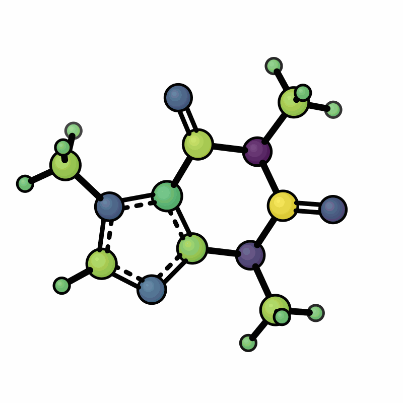
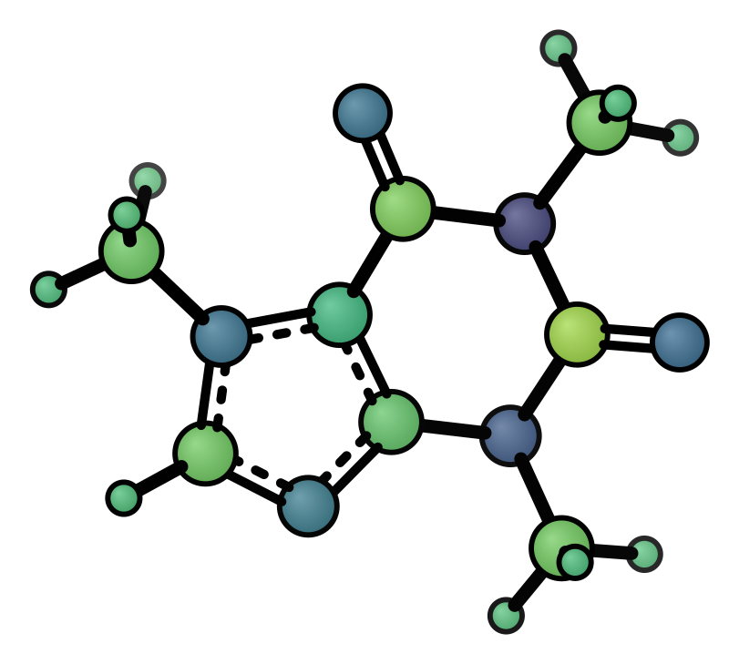

# Atom Colormap

Color atoms by a per-atom scalar value (e.g. partial charges, NMR shifts, Fukui indices) using a Viridis colormap.

| Mulliken charges (rotation) | Symmetric range |
|----------------------------|----------------|
|  |  |

```bash
xyzrender caffeine.xyz --hy --cmap caffeine_charges.txt --gif-rot -go caffeine_cmap.gif
xyzrender caffeine.xyz --hy --cmap caffeine_charges.txt --cmap-range -0.5 0.5
```

The colormap file has two columns — **1-indexed atom number** and value. Any extension works. Header lines (first token not an integer), blank lines, and `#` comment lines are silently skipped.

```text
# charges.txt
1  +0.512
2  -0.234
3   0.041
```

- Atoms **in the file**: colored by Viridis (dark purple → blue → green → bright yellow)
- Atoms **not in the file**: white (`#ffffff`). Override with `"cmap_unlabeled"` in a custom JSON preset
- Range defaults to min/max of provided values; use `--cmap-range vmin vmax` for a symmetric scale

| Flag | Description |
|------|-------------|
| `--cmap FILE` | Path to colormap data file (two-column: atom index, value) |
| `--cmap-range VMIN VMAX` | Override colormap range (useful for symmetric scales, e.g. `-0.5 0.5`) |
