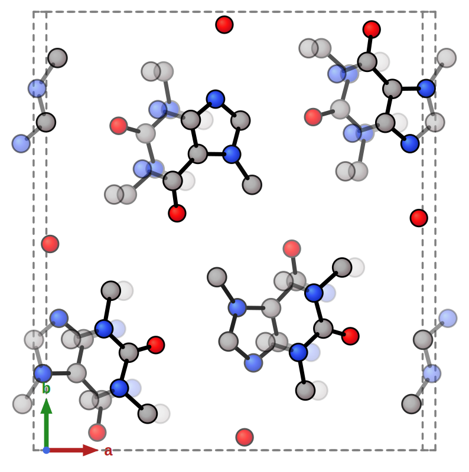
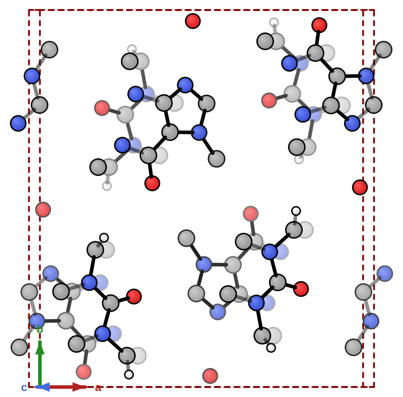
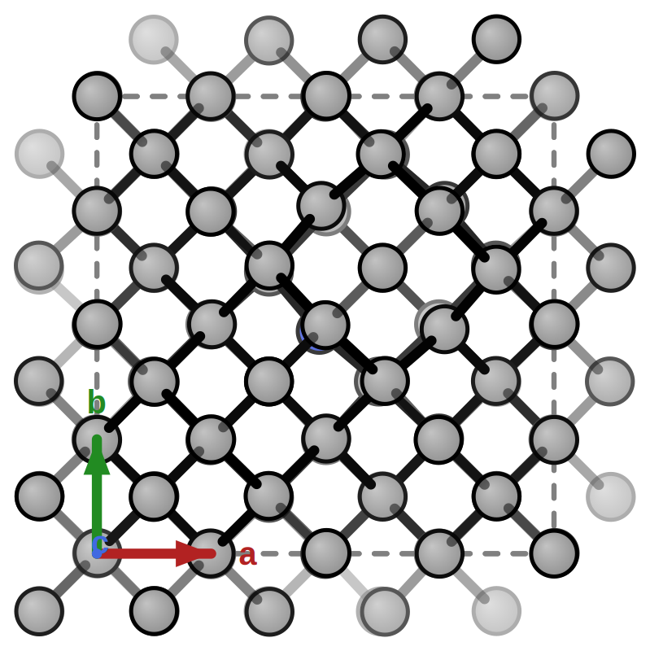
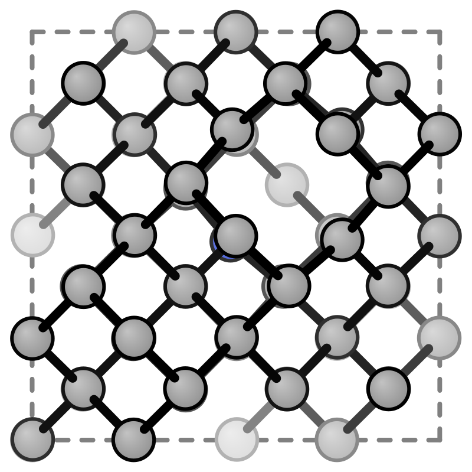
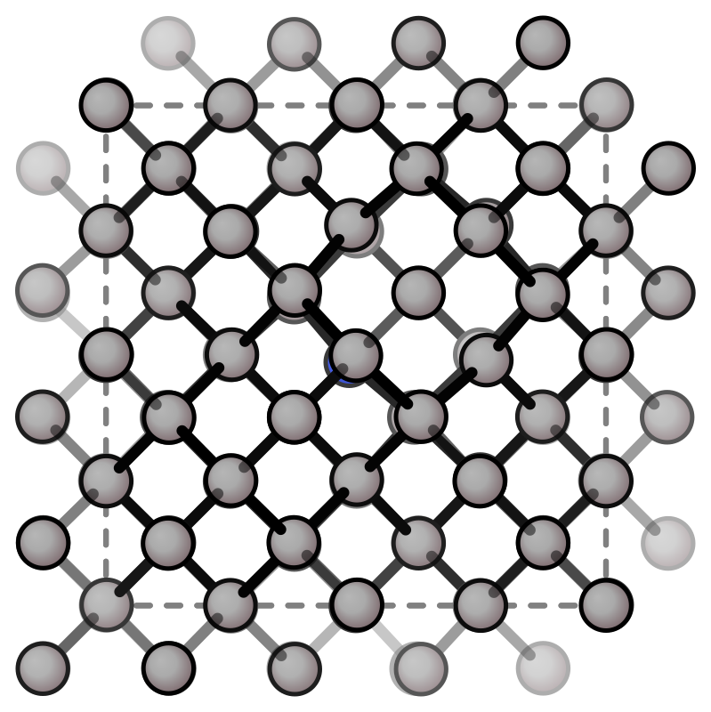

# Crystal Structures

## extXYZ unit cell

Draw the unit cell box for periodic structures from an extXYZ file with a `Lattice=` header. The cell is detected automatically — no extra flag needed.

| Unit cell | Cell rotation | Custom color |
|-----------|--------------|-------------|
|  |  |  |

| Default | No ghost atoms | No cell box |
|---------|---------------|------------|
|  |  |  |

```bash
xyzrender caffeine_cell.xyz -o caffeine_cell.svg
xyzrender caffeine_cell.xyz --gif-rot -go caffeine_cell.gif
xyzrender caffeine_cell.xyz --cell-color maroon -o caffeine_cell_custom.svg
xyzrender NV63_cell.xyz --no-ghosts --no-axes -o NV63_cell_no_ghosts.svg
xyzrender NV63_cell.xyz --no-cell -o NV63_cell_no_cell.svg
```

```{note}
**Bond orders are disabled by default** for periodic structures — geometry-based perception is not PBC-aware. Pass `--bo` to re-enable.
```

The **extXYZ** comment line must contain a `Lattice=` key with the 3×3 cell matrix as nine space-separated floats. Tools like [ASE](https://wiki.fysik.dtu.dk/ase/) can export to extXYZ from CIF or other periodic formats.

## VASP / Quantum ESPRESSO

Requires `pip install 'xyzrender[crystal]'` (phonopy).

| VASP (NV63) | VASP rotation | QE (no axes) |
|------------|--------------|-------------|
|  |  |  |

```bash
xyzrender NV63.vasp --crystal vasp -o NV63_vasp.svg
xyzrender NV63.vasp --crystal --gif-rot -go NV63_vasp.gif
xyzrender NV63.in --crystal qe --no-axes -o NV63_qe.svg
```

Format is auto-detected from extension (`.vasp`, `POSCAR`, `CONTCAR` → VASP; `.in` → QE).

## Crystallographic viewing direction

Orient the crystal looking down a given crystallographic direction with `--axis` (3-digit Miller index):

| View along [001] | View along [111] | Rotate around [111] |
|-----------------|-----------------|-------------------|
| ![View along [001]](../../../examples/images/NV63_001.svg) | ![View along [111]](../../../examples/images/NV63_111.svg) | ![Rotate around [111]](../../../examples/images/NV63_111.gif) |

```bash
xyzrender NV63_cell.xyz --axis 001 -o NV63_001.svg
xyzrender NV63_cell.xyz --axis 111 -o NV63_111.svg
xyzrender NV63_cell.xyz --axis 111 --gif-rot 111 -o NV63_111.svg -go NV63_111.gif
```

## Crystal flags

| Flag | Description |
|------|-------------|
| `--crystal [{vasp,qe}]` | Load VASP/QE structure via phonopy; format auto-detected or explicit |
| `--cell` | Force cell rendering for extXYZ (usually not needed) |
| `--no-cell` | Hide the unit cell box |
| `--ghosts` / `--no-ghosts` | Show/hide ghost (periodic image) atoms outside the cell |
| `--ghost-opacity` | Opacity of ghost atoms/bonds (default: 0.5) |
| `--axes` / `--no-axes` | Show/hide the a/b/c axis arrows |
| `--cell-color` | Unit cell box color (hex or named, default: `gray`) |
| `--cell-width` | Unit cell box line width (default: 2.0) |
| `--axis HKL` | Orient looking down a crystallographic direction (e.g. `111`, `001`) |
