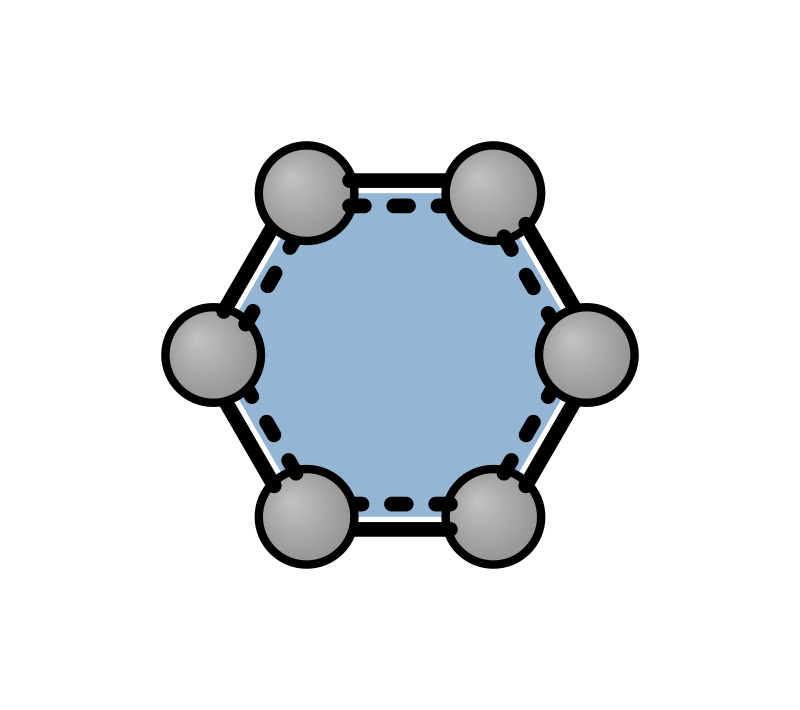
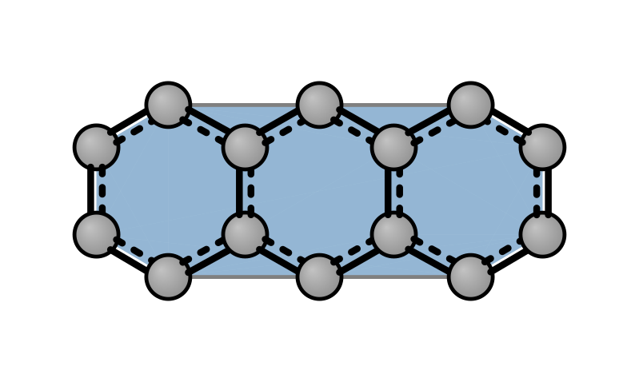
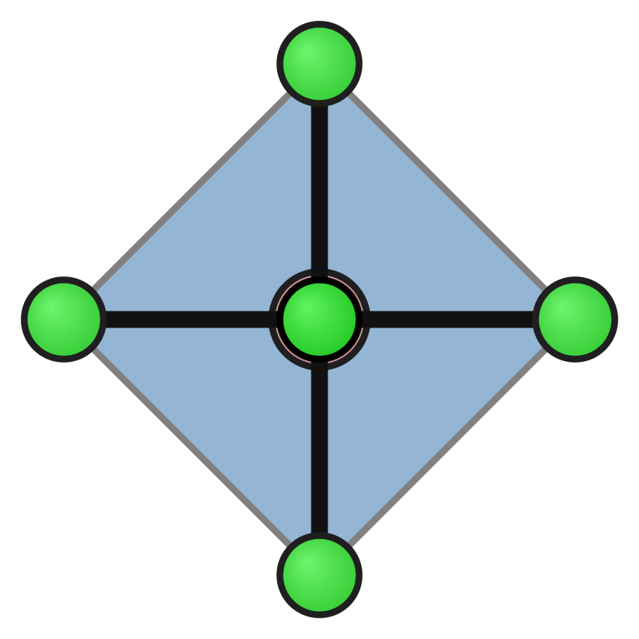

# Convex hull

Draw the convex hull of selected atoms as semi-transparent facets — useful for aromatic rings, coordination spheres, or any subset of atoms. Facets are depth-sorted for correct occlusion. Optionally, hull edges that do not coincide with bonds are drawn as thin lines for better 3D perception.

Use `--hull` from the CLI for the full molecule, or from Python set `config.hull_atom_indices`: a flat list of 0-based indices for one hull, or a list of lists for multiple hulls (e.g. several rings) with optional per-subset `hull_colors` and `hull_opacities`.

| Benzene ring | Anthracene (all ring carbons) | CoCl₆ octahedron |
|--------------|-------------------------------|------------------|
|  |  |  |

**CLI:**

```bash
xyzrender benzene.xyz --hull --hull-color steelblue --hull-opacity 0.35 -o benzene_ring_hull.svg
```

**Python (subset indices):**

```python
from xyzrender import load, build_config, render, render_gif

# Single subset: one hull (e.g. benzene ring carbons, indices 0–5)
benzene = load("structures/benzene.xyz")
cfg = build_config("default", hull=True, hull_color="steelblue", hull_opacity=0.35)
cfg.hull_atom_indices = [0, 1, 2, 3, 4, 5]
render(benzene, config=cfg, output="images/benzene_ring_hull.svg")
render_gif(benzene, gif_rot="y", config=cfg, output="images/benzene_ring_hull.gif")

# Multiple subsets: list of index lists (e.g. two rings with different colors)
# cfg.hull_atom_indices = [[0, 1, 2, 3, 4, 5], [6, 7, 8, 9, 10, 11]]
# cfg.hull_colors = ["steelblue", "coral"]
# cfg.hull_opacities = [0.35, 0.25]
```

**Config options:**

| Option | Description |
|--------|-------------|
| `show_convex_hull` | Enable hull rendering |
| `hull_atom_indices` | `None` = all non-dummy atoms; flat list = one subset; list of lists = multiple hulls |
| `hull_color` / `hull_opacity` | Default fill (hex or named) |
| `hull_colors` / `hull_opacities` | Per-subset when using multiple subsets |
| `show_hull_edges` | Draw non-bond hull edges as thin lines (default: true) |
| `hull_edge_color` / `hull_edge_width_ratio` | Edge style |

Examples in this section are generated from `examples/examples.ipynb` (benzene, anthracene, CoCl₆).
