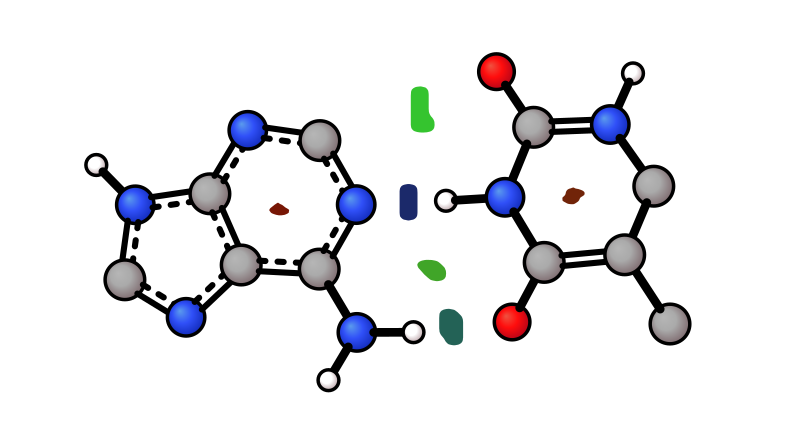
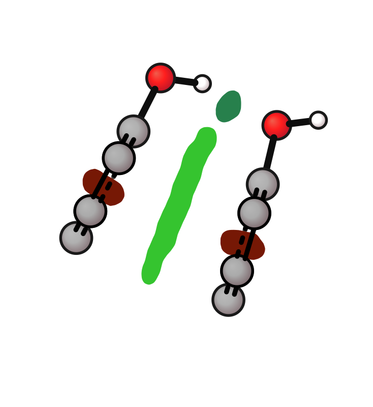
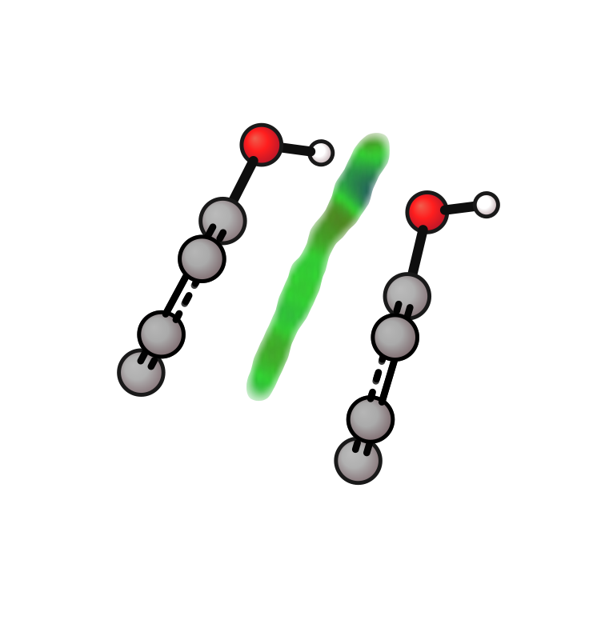
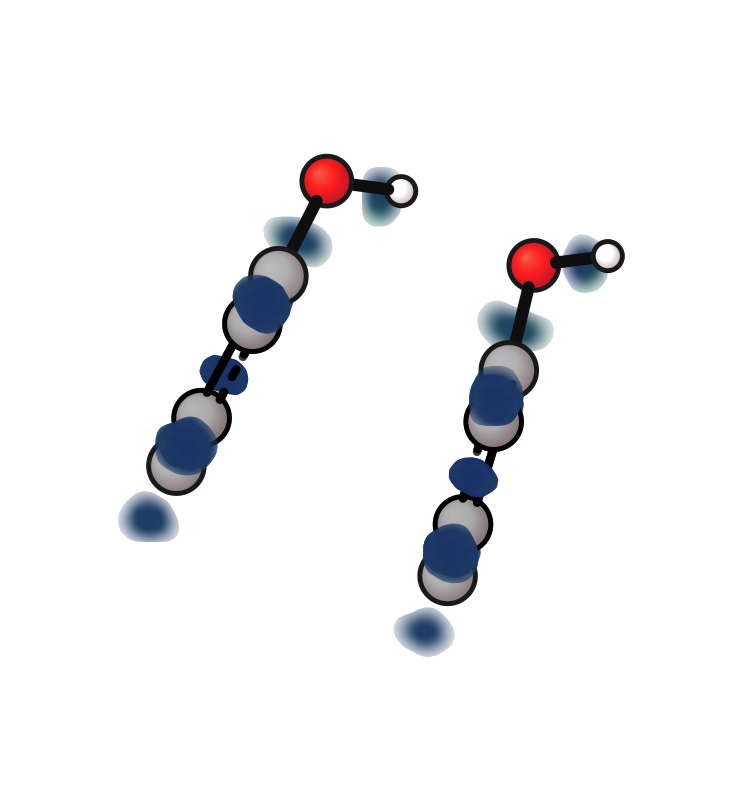
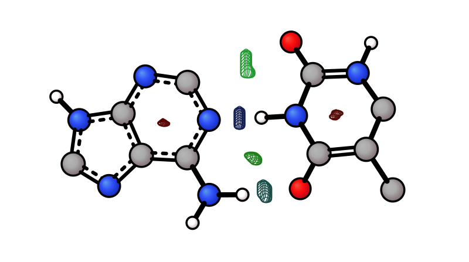

# NCI Surface

```{note}
Surface plots are schematic 2D representations suitable for figures. For quantitative isosurface analysis, use a dedicated 3D viewer (VMD, PyMOL).
```

Visualise non-covalent interaction surfaces from a signed colouring field as the main input plus a second cube that defines the surface geometry.

For standard [NCIPlot](https://github.com/juliacontrerasgarcia/NCIPLOT-4.2) output, use `sign(λ₂)·ρ` density as the main input and reduced density gradient as `--nci-surf`.

For Multiwfn IGMH output, use `sl2r.cub` as the main input and `dg.cub`, `dg_inter.cub`, or `dg_intra.cub` as `--igmh-surf`.

The surface is rendered as individual flat-filled patches per interaction region. Coloring is based on the sign of `λ₂` weighted by density: **blue** = strong attractive (H-bond), **green** = weak/vdW, **red** = repulsive (steric).

| H-bond (base pair) | π-stacking (phenol dimer) |
|-------------------|--------------------------|
|  |  |

```bash
# avg coloring (default): blue=H-bond, green=vdW, red=steric
xyzrender base-pair-dens.cube --nci-surf base-pair-grad.cube -o base-pair-nci_surf.svg
xyzrender phenol_di-dens.cube --nci-surf phenol_di-grad.cube -o phenol_di-nci_surf.svg

# Multiwfn IGMH: sl2r colour field + δg surface
xyzrender sl2r.cub --igmh-surf dg_inter.cub --iso 0.005 -o igmh_dg_inter.svg

# per-pixel (more detail)
xyzrender base-pair-dens.cube --nci-surf base-pair-grad.cube --nci-mode pixel

# flat color (default: forestgreen)
xyzrender base-pair-dens.cube --nci-surf base-pair-grad.cube --nci-mode uniform

# flat color with custom colour
xyzrender base-pair-dens.cube --nci-surf base-pair-grad.cube --nci-mode teal
```

Independent Gradient Model based on Hirshfeld partition (IGMH) can be similarly visualised using `--igmh-surf` alongside an `sl2r.cub` colouring field. The examples below use phenol dimer `dg_inter` and `dg_intra` cubes to show intermolecular and intramolecular interactions separately.

| Inter (`dg_inter`, `--iso 0.005`) | Intra (`dg_intra`, `--iso 0.2`) |
|-----------------------------------|---------------------------------|
|  |  |

```bash
# intermolecular interaction surface
xyzrender phenol_di-sl2r.cub --igmh-surf phenol_di-dg_inter.cub --nci-mode pixel --iso 0.005 -o phenol_di_igmh_inter.svg

# intramolecular interaction surface
xyzrender phenol_di-sl2r.cub --igmh-surf phenol_di-dg_intra.cub --nci-mode pixel --iso 0.2 -o phenol_di_igmh_intra.svg
```

Coloring modes (`--nci-mode`):

| Mode | Description |
|------|-------------|
| `avg` (default) | Each NCI lobe filled with its mean `sign(λ₂)·ρ`: **blue** = H-bond, **green** = vdW, **red** = steric |
| `pixel` | Per-pixel `sign(λ₂)·ρ` raster — shows intra-lobe variation (not a very nice render styling at the moment) |
| `uniform` | Flat single color for all NCI regions (default: `forestgreen`) |
| *colour* | Any colour name or hex — shorthand for uniform mode with that colour |

Surface styles also work on NCI patches:

| Mesh |
|------|
|  |

```bash
xyzrender base-pair-dens.cube --nci-surf base-pair-grad.cube --surface-style mesh
```

All NCI surface flags:

| Flag | Description |
|------|-------------|
| `--nci-surf GRAD_CUBE` | Reduced density gradient cube file for standard NCIPLOT-style NCI rendering |
| `--igmh-surf DG_CUBE` | IGMH `δg` cube file for IGMH surface rendering |
| `--nci-mode MODE` | Coloring: `avg` (default), `pixel`, `uniform`, or a colour name/hex |
| `--iso` | Surface isovalue threshold. Standard NCI/RDG uses the usual NCI default; IGMH `dg*` surfaces typically use `0.005` a.u. |
| `--opacity` | Surface opacity multiplier (default: 1.0) |
| `--surface-style STYLE` | `solid` or `mesh` recommended; `contour`, `dot` also available. These use avg lobe colour |
| `--nci-cutoff CUTOFF` | Density magnitude cutoff (advanced — not needed for standard NCIPLOT output) |

Sample structures from [NCIPlot](https://github.com/juliacontrerasgarcia/NCIPLOT-4.2/tree/master/tests).
