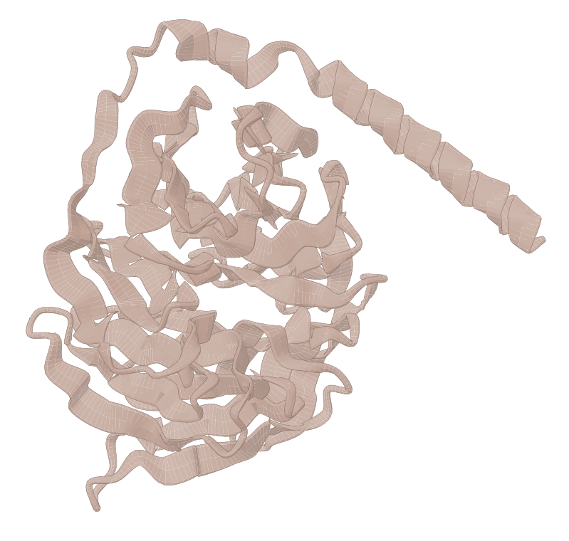
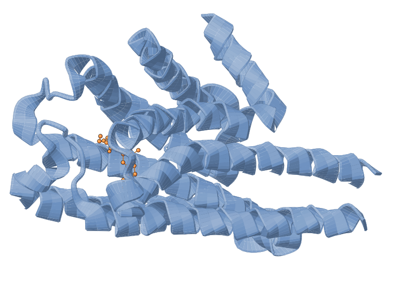
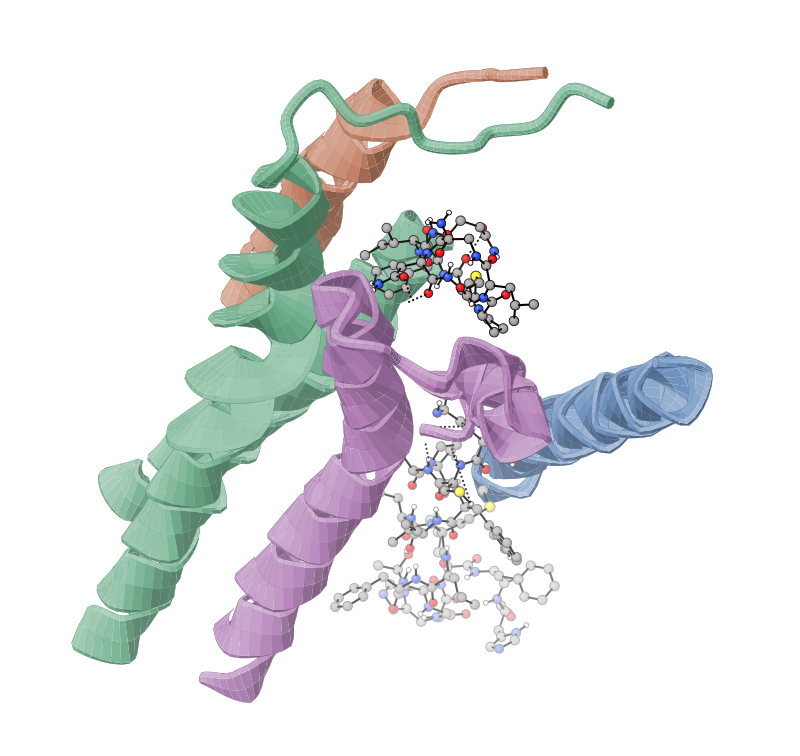

# Proteins & biomolecules

Render proteins as a shaded 3D cartoon rather than atoms and bonds — helices as coiled tapes, strands as arrows, loops as tubes. Ball-and-stick is unreadable above a few hundred atoms, so this is the mode to use for anything from a PDB.

Use `--protein` from the CLI, or pass `protein=True` to `render()`. Backbone and sidechain atoms are hidden and replaced by the ribbon; ligands, ions and waters keep drawing as ball-and-stick alongside it. The cartoon is also *faster* than atoms — an 8,626-atom structure renders in ~0.5 s against ~36 s for ball-and-stick, because it draws one surface per chain instead of thousands of spheres.

| Gloss (default) | Illustration | Ligand highlight | Ligand NCI | Ligand NCI (custom colour) |
|-----------------|--------------|------------------|------------|----------------------------|
|  |  |  |  |  |

## Secondary structure and confidence

Secondary structure comes from `HELIX`/`SHEET` records when the file has them, supplemented by geometry inference (CA torsion plus i→i+2 / i→i+3 distances, with a strand-pairing requirement so an extended loop is not mistaken for a β-strand). What you get depends on how much the file supports:

| Tier | Rendered as | When |
|------|-------------|------|
| `FULL_RIBBON` | Helices, arrows and loops | Backbone atoms (N/CA/C/O) resolvable per residue |
| `TRACE_ONLY` | A plain round tube along the CA trace | Chain topology is clear but backbone atoms are not |
| `INSUFFICIENT` | Nothing — falls back to ball-and-stick | No usable chain/residue metadata |

xyzrender reports the tier it used on stderr, so a structure that renders as a bare tube tells you why.

Inference is only needed when the file carries no `HELIX`/`SHEET` records, and it is weakest on small all-β folds, where tight turns between strands are extended enough to read as strand themselves. On a mixed α/β structure it agrees with the deposited records on ~86-90% of residues; on a compact all-β domain that can fall to ~60-70%. Files with SS records are unaffected — records always win.

## Styles

`gloss` (the default) uses strong Lambert shading with a hairline contour. `illustration` is flatter with a heavier dark contour, for a textbook look. `cartoon` is accepted as an alias for `gloss`.

Both draw a true silhouette — the outline follows the surface boundary, not every interior mesh edge — which is what lets overlapping strands of a β-sheet read as separate.

## Colouring

`--color-by` takes four modes:

| Mode | Meaning |
|------|---------|
| `chain` | One palette colour per chain (default) |
| `rainbow` | N→C gradient within each chain |
| `ss` | By secondary structure — helix, strand, coil |
| `bfactor` | Temperature factor, or AlphaFold pLDDT |

Chain colours are allocated over every chain in the file and then filtered, so excluding a chain does not recolour the others — the same chain keeps its colour across a figure series. Override individual chains with `--chain-color A steelblue`.

```{note}
`bfactor` maps low values to one end of the ramp and high to the other. In a crystal structure low B means well-ordered; in an AlphaFold model the same field holds pLDDT, where **high** means confident. The ramp does not currently detect which it has been given.
```

## Selecting what to draw

`--exclude-chains "A,B"` drops chains entirely — their ribbon, and any ligand, ion or water belonging to them. Excluded chains are also left out of the canvas fit, so the remaining chains fill the frame.

`--sidechain` draws sidechains on top of the ribbon, attached where they leave the tape surface rather than floating from the backbone. Pass residues to restrict it: `--sidechain "45,102-108"` or `--sidechain "A:45"`.

`--highlight-ligand` recolours ligands (HETATM excluding water and ions); `--ligand-color` sets the colour. `--glow` also understands semantic tokens — `--glow ligand`, `--glow sidechain`, `--glow backbone`, `--glow water`, `--glow ion`, `--glow hetatm`, `--glow protein` — so you can pick out a group without knowing its atom indices.

## Ligand contacts

`--nci-ligand` keeps only the non-covalent interactions that involve the ligand and drops the rest, which is what makes a binding-site figure legible. It implies `--nci` detection.

**CLI:**

```bash
# Default cartoon, one chain
xyzrender 8UWL.pdb --protein --exclude-chains "A,B,D,E" -o gloss.svg

# Textbook style, coloured by secondary structure
xyzrender 8UWL.pdb --protein illustration --color-by ss -o ss.svg

# Confidence colouring for a predicted model
xyzrender AF-P00520.pdb --protein --color-by bfactor -o plddt.svg

# Binding site: ligand highlighted, its contacts kept, sidechains shown
xyzrender complex.pdb --protein --highlight-ligand --nci-ligand \
    --sidechain "45,102-108" -o site.svg

# Rotation GIF
xyzrender 8UWL.pdb --protein --gif-rot --rot-frames 24 -go spin.gif
```

**Python:**

```python
from xyzrender import load, render, render_gif

mol = load("8UWL.pdb")

render(mol, protein=True, color_by="ss", output="ss.svg")
render(mol, protein="illustration", exclude_chains="A,B,D,E", output="chainC.svg")

# Highlight the ligand and glow it, showing selected sidechains
render(mol, protein=True, ligand_highlight=True, ligand_color="#ff9f45",
       glow="ligand", sidechain="45,102-108", output="site.svg")

render_gif(mol, protein=True, gif_rot="y", rot_frames=24, output="spin.gif")
```

**Options (passed to `render()`):**

| Option | Description |
|--------|-------------|
| `protein` | `True` for the default style, or `"gloss"` / `"illustration"` / `"cartoon"` |
| `color_by` | `"chain"` (default), `"rainbow"`, `"ss"`, `"bfactor"` |
| `chain_colors` | Per-chain overrides, e.g. `{"A": "steelblue"}` |
| `exclude_chains` | Chain IDs to drop, as `"A,B"` or `["A", "B"]` |
| `ribbon_width` | Tape width in Å for helices and strands (default 4.5) |
| `loop_width` | Tube width cap in Å for coils (default 0.9) |
| `sidechain` | `True` for all, or a residue selector such as `"45,102-108"` / `"A:45"` |
| `ligand_highlight` | Recolour ligands (HETATM excluding water and ions) |
| `ligand_color` | Ligand highlight colour (default `#ffb347`) |
| `nci_ligand_protein_only` | Keep only ligand-associated NCI contacts |

## Formats

`.pdb` is fully supported. **mmCIF is not yet readable** — the underlying CIF reader handles small-molecule CIF only, and an mmCIF file raises a clear error rather than failing obscurely. Convert to PDB in the meantime.

Placeholder `CRYST1` records (`1 1 1 90 90 90 P 1`), which non-crystallographic entries are required to carry, are ignored rather than drawn as a sub-Ångström unit cell.
